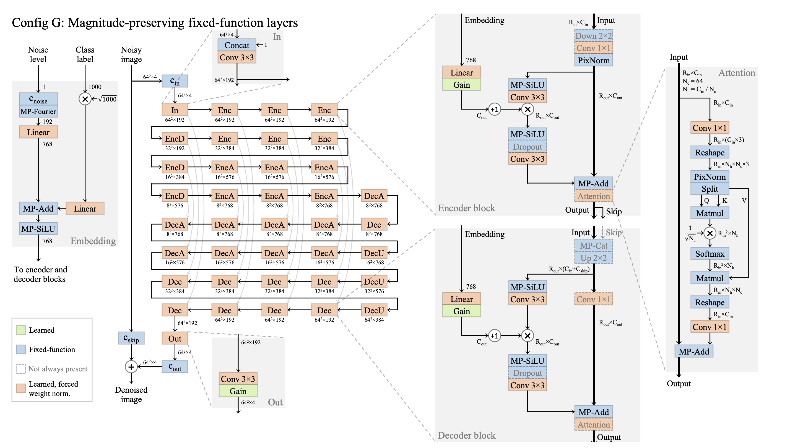

# jax-edm2



Love ``jax``? Tired of not having good networks pre-implemented and the infrastructure being less robust than PyTorch? Bummed that HuggingFace Diffusers just let go of Flax?

To help with all of that, this repository contains an implementation of NVIDIA's latest and greatest EDM2 UNet architecture in ``jax``. For the official PyTorch implementation, see [https://github.com/NVlabs/edm2](https://github.com/NVlabs/edm2).

As described in ``example.py``, usage of the network is simple:

```
## initialize the model
model = edm2_net.PrecondUNet(
    img_resolution=32,
    img_channels=3,
    label_dim=10,
    sigma_data=0.5,
    logvar_channels=128,
    use_bfloat16=True,
    unet_kwargs={
        "model_channels": 128,
        "channel_mult": [2, 2, 2],
        "num_blocks": 3,
        "attn_resolutions": [16, 8],
        "use_fourier": False,
        "block_kwargs": {"dropout": 0.13},
    },
)

## note that we use the pytorch (NCHW) convention
prng_key = jax.random.PRNGKey(42)
ex_input = jax.random.normal(prng_key, (1, 3, 32, 32))
ex_t = jnp.array([0.0])
ex_label = jax.nn.one_hot(0, num_classes=10).reshape((1, -1))

## initialize the model parameters
params = model.init(
    {"params": prng_key},
    ex_t,
    ex_input,
    ex_label,
    train=False,
    calc_weight=True,
)
print(f"Number of parameters: {ravel_pytree(params)[0].size}")

## note need to project to sphere due to jax functional style
## this also needs to happen after every gradient step in a training loop!
params = edm2_net.project_to_sphere(params)
```

The EDM2 network architecture relies on careful normalization and projection of the weights. In PyTorch, this can happen in the network itself. Because ``jax`` is functional, this will need to happen in the training loop. As shown in the above code snippet, we've included a function ``project_to_sphere`` that accomplishes this projection for you. Just apply it after every gradient step.

# References
